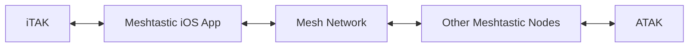

import ReactPlayer from "react-player";

We're excited to announce a major new feature in the Meshtastic iOS app: TAK Server integration. This update bridges two powerful ecosystems—Meshtastic's long-range mesh networking and the Team Awareness Kit (TAK) family of applications such as iTAK.

{/* truncate */}

## What is TAK?

The Team Awareness Kit (TAK) is a geospatial mapping and situational awareness platform originally developed for the U.S. military. It has since been adopted by first responders, search and rescue teams, disaster relief organizations, and outdoor enthusiasts. TAK applications display team members' positions on a shared map, allow placement of markers and annotations, and support text messaging—all using the Cursor on Target (CoT) protocol.

iTAK is one of the iOS options for this platform, providing a subset of the same powerful ATAK capabilities on iPhone and iPad.

## Why TAK and Meshtastic?

TAK traditionally relies on network connectivity or dedicated servers. But what happens when you're:

- Deep in the backcountry with no cell service?
- Responding to a disaster where infrastructure is down?
- Operating in remote areas beyond traditional network reach?

This is where Meshtastic shines! Our mesh radios can communicate over long distances without any infrastructure, hopping messages through the network until they reach their destination.

## The Challenge: A Tale of Two Platforms

On Android, integrating Meshtastic with ATAK is straightforward. ATAK's plugin architecture allows the Meshtastic ATAK plugin to hook directly into the app, bridging mesh communication seamlessly. Android users have enjoyed this capability for years.

iOS tells a different story. Apple's sandboxing and app isolation prevent iTAK from loading external plugins the way ATAK can. This left iOS users without a path to TAK integration—until now.

## The Solution: TAK Inside the Meshtastic App

The new TAK integration in Meshtastic iOS creates a bridge between these two worlds:

### How It Works

Our solution was to build a TAK server directly into the Meshtastic iOS app!

When you enable the TAK Server feature, the Meshtastic app spins up a local TAK-compliant server endpoint on your device. iTAK connects directly to this local server just as it would connect to any cloud-based TAK server—no special configuration or workarounds required from the user's perspective.

Behind the scenes, the integration handles the translation between TAK's CoT XML protocol and Meshtastic's efficient mesh packets. The result is transparent to users—iTAK simply works, as if connected to a traditional TAK server.

### Key Features

#### Position Sharing (PLI)

Your location from iTAK is automatically shared across the mesh. Team members running ATAK on Android or iTAK on other iOS devices will see your position update in real-time on their maps—no cell towers required.

#### GeoChat Messaging

Send and receive text messages between TAK clients through the mesh. Whether you're coordinating a search grid or checking in with base camp, messages flow seamlessly across the mesh network into your connected TAK clients.

#### Markers / Points of Interest

Drop a marker in iTAK for a found item, hazard, or rally point—it propagates through the mesh to all connected TAK clients automatically.

## Getting Started

<ReactPlayer
  url="/img/blog/start-tak-server.mp4"
  controls
  width="100%"
/>

1. Update to the latest Meshtastic iOS app from the App Store
2. Set your node's device role to **TAK** or **TAK Tracker** so it appears in the TAK ecosystem
3. Configure your TAK settings in the app (Settings → Scroll to the bottom: TAK Server) and start the TAK Server
4. Connect iTAK to the Meshtastic app's local TAK endpoint by downloading the Data Package from the app and importing it into iTAK
5. Go off-grid with full situational awareness!

## What's Next

This is just the beginning. We're working on a second iteration of Meshtastic's native TAK protocol layer, bringing even tighter integration and wire optimization to the ecosystem. Stay tuned for more updates as we continue bridging these two powerful platforms.
